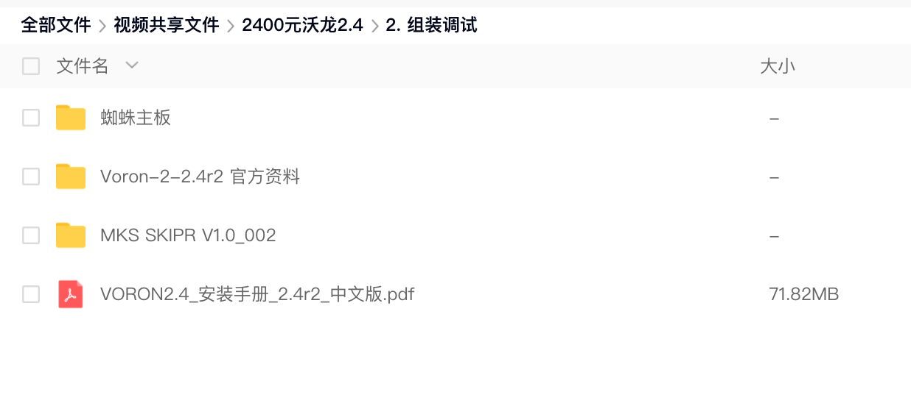
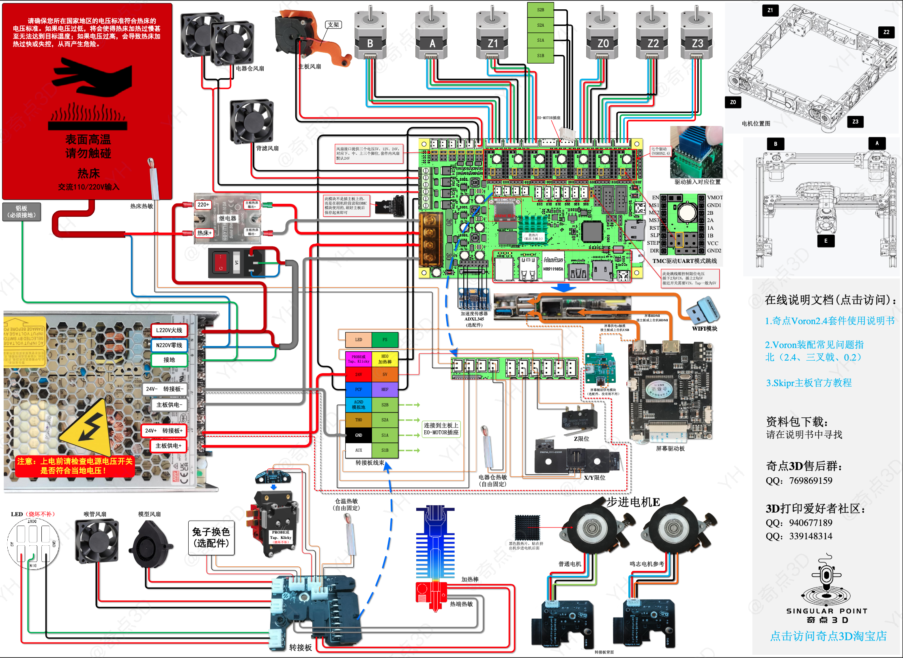

# 一灰Voron2.4省心方案

>### **视频来源**：[Bilibili@我是小一灰](https://www.bilibili.com/video/BV1Cd4y1i7Pa "我是小一灰")
>### QQ交流群：940677189（满）、339148314（2群）
> ### **Gitee（国内）项目地址**：[Voron2.4省心方案](https://gitee.com/yifeilu/Voron2.4 "我是小一灰")
> ### **Github项目地址**：[Voron2.4省心方案](https://github.com/YihuiLu/Voron2.4 "我是小一灰")

## 方案介绍：
一个被1000+人选择的Voron2.4装配方案，所有搭配、升级方案都经过挑选和论证，也很容易买到，可以帮助你用更低的成本装出一个高性价比的Voron2.4，并有不同尺寸和预算可选。

## 其他资料：
#### **BOM单**：[【腾讯文档】Voron2.4 BOM](https://docs.qq.com/sheet/DYnVpeVNUTHFTaHdw "我是小一灰")
#### **BOM单**：[【GoogleDrive】三叉戟BOM](https://docs.google.com/spreadsheets/d/1P-CZUSm6V10GVYbEuxUOMceSAsGVq84E/edit?usp=drive_link&ouid=100174795811879382850&rtpof=true&sd=true "我是小一灰")

#### **资料包下载地址2**：[百度云盘 | 提取码：ImYH](https://pan.baidu.com/s/1MlJEao7r2y7Jb6WBcggHnQ?pwd=ImYH "我是小一灰")

#### 主板、驱动散热风扇支架：已上传至本项目"主板散热支架"文件夹。

#### 屏幕支架（百度云）：https://pan.baidu.com/s/19mTuXdeaKCQE-1kaWURAGw 提取码: 2v3t
#### 屏幕支架（GoogleDrive）：https://drive.google.com/file/d/1Th-2ryH3IjCn2Ey7RBrqZtft3pnhlUIA/view?usp=drive_link

##### - ps:中文装配文档在资料包中 -

### **方案中使用到的接线图：**
#### **腾讯文档在线查看**：[Voron2.4接线图](https://docs.qq.com/pdf/DYkVqTnBob2xzUEhR? "我是小一灰")
#### **GoogleDrive在线查看**：[Voron2.4接线图](https://drive.google.com/file/d/12_wtBbF1vBpWM0nNy4lV2uWEw3sMo3vR/view?usp=drive_link "我是小一灰")
对于MKS Skipr主板

### 注意事项：

1. 配置文件以此项目为准，可能会更新
2. 由于Git不便存储大文件，所以请结合云盘下载
3. 所有资料优先使用在线版本，离线版本更新很慢
4. 国外小伙伴若无法访问部分资料请提issue

### 其他说明：

1. 方案中的接线图使用的是创客基地的Skipr V1.0主板
2. 建议使用全新配件
3. 资料异常若无法联系到一灰可发邮件：yihuiwork@outlook.com